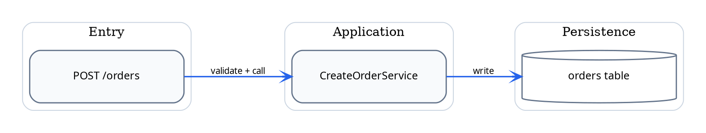
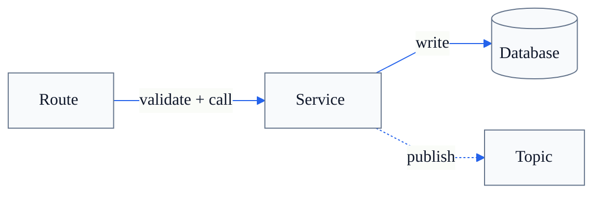

# Diagram Templates

## Default Graphviz DOT template

Use this for most code-driven route maps.



### Regular layout additions

Use these layout helpers when the first render looks skewed:

```dot
{ rank=same; route; service; db; }

route [group="g1"];
service [group="g2"];
db [group="g3"];

route -> service -> db [style=invis, weight=2];
```

- Use `rank=same` to align siblings in one row or column.
- Use `group` to stabilize column membership across ranks.
- Use a few invisible edges with moderate weight to keep the grid tidy.
- Keep node labels to 2 to 3 short lines. Split long API or symbol names across lines.
- Prefer overview diagrams with a small number of columns instead of many jagged intermediate nodes.

### Edge style conventions

- synchronous call: default solid edge
- async publish or consume: `style=dashed`
- indirect or inferred relation: `style=dotted`
- external service: use a distinct node fill or edge color, but keep the palette restrained

### Node conventions

- route, handler, controller: rounded rectangle
- service or use case: rounded rectangle
- database or cache: cylinder
- queue, topic, stream: box with explicit label such as `Kafka topic: orders`
- external API: box with a clearer boundary label such as `Stripe API`

## Strict black-and-white Graphviz template

Use this when the user asks for monochrome output or when the diagram will be printed.

```dot
digraph RouteMapBW {
  graph [
    rankdir=LR,
    newrank=true,
    bgcolor="white",
    pad="0.24",
    nodesep="0.42",
    ranksep="0.82",
    splines=ortho
  ];

  node [
    shape=box,
    style="rounded,filled",
    fillcolor="white",
    color="black",
    penwidth=1.5,
    fontname="Microsoft YaHei UI",
    fontsize=12,
    margin="0.12,0.08"
  ];

  edge [
    color="black",
    penwidth=1.2,
    arrowhead=vee,
    fontname="Microsoft YaHei UI",
    fontsize=10
  ];
}
```

## Mermaid fallback template

Use this only when the user wants markdown-native output.



## PlantUML fallback rule

When the user explicitly asks for PlantUML, switch to the shared header and black-and-white conventions in `references/plantuml-templates.md`.
