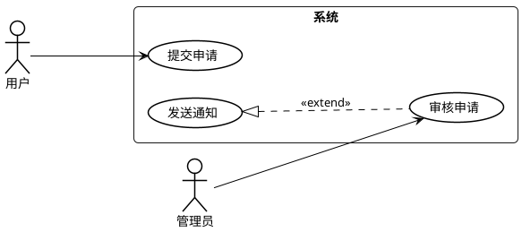
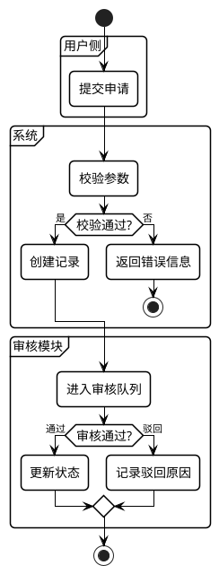

# PlantUML Templates

## Shared Header

```plantuml
@startuml
' --- 通用配置 ---
skinparam shadowing false
skinparam backgroundColor white
skinparam defaultFontName "Microsoft YaHei"
skinparam roundcorner 10

' --- 活动图专用配置 ---
skinparam ConditionEndStyle diamond
skinparam activity {
    BackgroundColor white
    BorderColor black
    BorderThickness 1.5
    FontSize 14
}

' --- 用例图专用配置 ---
skinparam usecase {
    BackgroundColor white
    BorderColor black
    BorderThickness 1.5
}
skinparam actor {
    BackgroundColor white
    BorderColor black
    BorderThickness 1.5
}

' --- 线条与箭头 ---
skinparam arrow {
    Color black
    Thickness 1
}
```

Close every diagram with:

```plantuml
@enduml
```

## Use Case Skeleton



## Activity Diagram Skeleton



## Modeling Notes

- Prefer use case diagrams for actor-capability mapping, permissions, or system boundary discussions.
- Prefer activity diagrams for审批、退费、审核、状态流转、异常处理、回退、重试等流程问题。
- If the source material mixes role and flow concerns, choose the dominant question first and mention the inference after the code.
